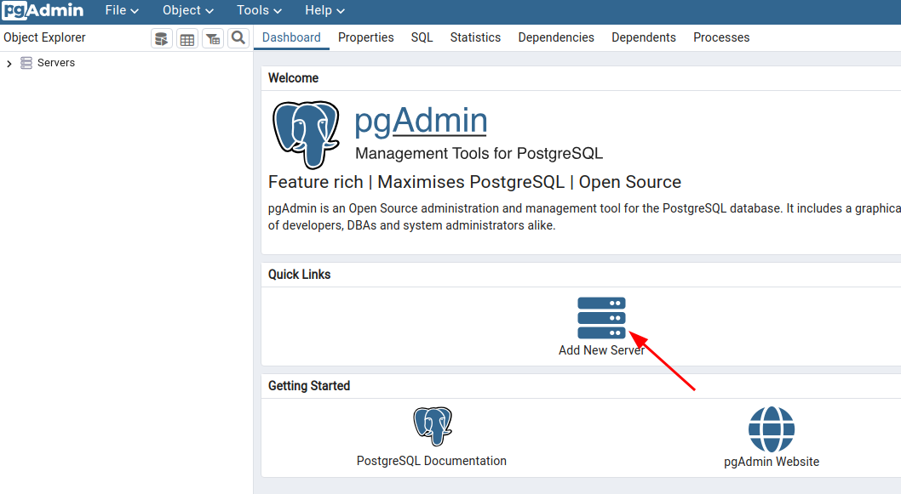
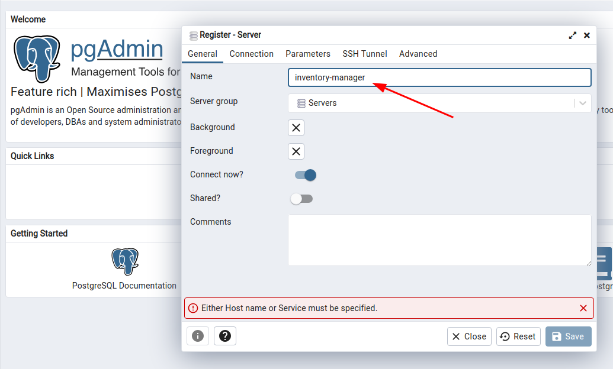
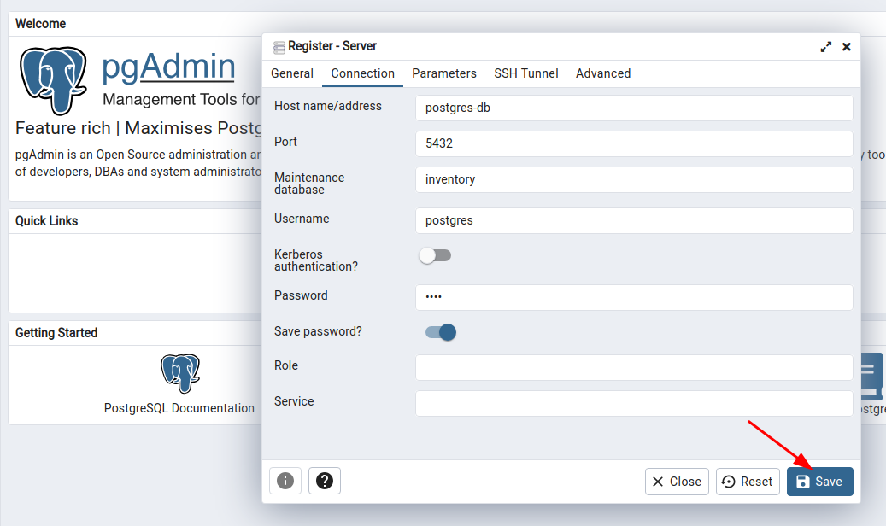
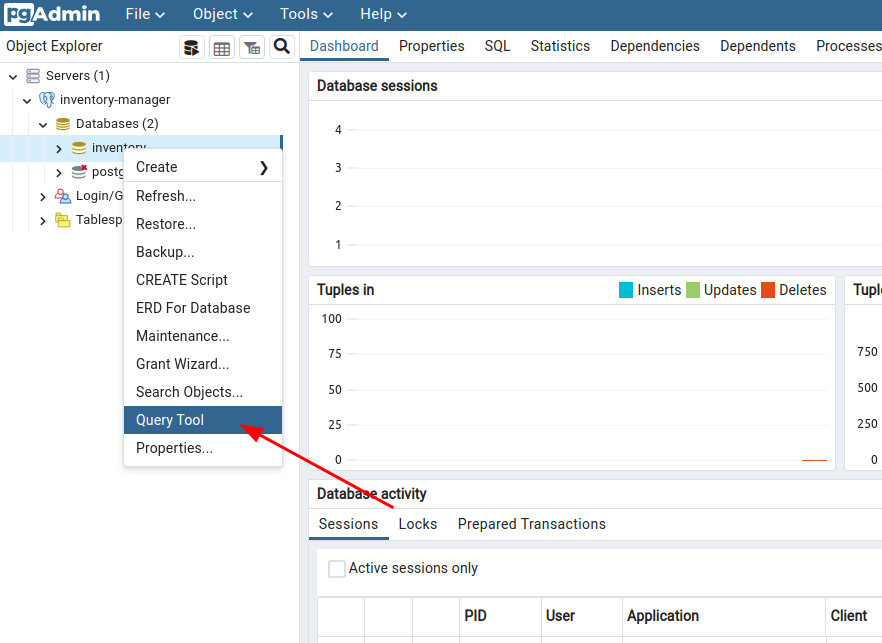
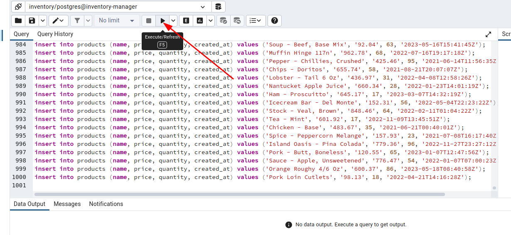

# Inventory Manager System

---
[](https://fastapi.tiangolo.com/)


[](https://shields.io/)
[](https://shields.io/)

[](https://skillicons.dev)

## Live Demo [Click Here](https://inventory.vitaliisili.com/products)

### Project Description:


*The objective of this project is to develop a simple inventory management system for a store.
The system will allow you to add products, remove products, update quantities, retrieve product
information, and calculate the total value of the inventory. It involves creating classes to represent
products and an inventory manager to handle product operations. You will implement unit tests using the
unittest module and mock external dependencies for testing*

### Requirements

- **Docker** &emsp;&emsp;
  &emsp;&emsp;&emsp;[How to install docker](https://tecadmin.net/how-to-install-docker-on-ubuntu-22-04/)
- **docker-compose**
  &emsp;[How to install docker-compose](https://www.digitalocean.com/community/tutorials/how-to-install-and-use-docker-compose-on-ubuntu-22-04)
- **node js** &emsp;&emsp;&emsp;
  &emsp;&emsp;[How to install NodeJs](https://techviewleo.com/how-to-install-node-js-18-lts-on-ubuntu/)

## How to use

### Method 1: Run Local

1. Clone project [Inventory-Manager-CRUD](https://github.com/vitaliisili/Inventory-Manager-CRUD)

```bash
git clone https://github.com/vitaliisili/Inventory-Manager-CRUD.git
```

2. Go to project folder

```bash
cd Inventory-Manager_CRUD
```

3. Create and activate virtual environment &emsp; [How to install virtualenv](https://www.cyberithub.com/how-to-install-virtualenv-on-ubuntu-20-04-lts-focal-fossa/)
4. Install all libraries from `requirements.txt`
```bash
 pip install -r requirements.txt --upgrade
```

5. Run PostgreSQl database and PgAdmin
```bash
docker-compose -f docker-compose-local.yml up -d
```

6. Create `.env` file in root directory
```bash
nano .env 
```

7. Copy next data to the `.env` file and save:
```python
DATABASE_PASSWORD=root
DATABASE_USERNAME=postgres
DATABASE_HOSTNAME=localhost
DATABASE_PORT=5432
DATABASE_PORT_TEST=5444
DATABASE_NAME=inventory
```

8. Run Python `uvicorn server`
```bash
uvicorn app.main:app --reload 
```

#### Backend is ready, next run react application

1. Open new tab in terminal

2. Go to folder `app-ui`
```bash
cd app-ui 
```

3. Create `.env` file in `app-ui` directory and copy next data to file
```python
REACT_APP_BACKEND_URL=http://localhost:8000
```

4. Install required packages from `package.json` run command below
```bash
npm install
```

5. Start react application
```bash
npm run start
```

6. Browser will open automatically on http://localhost:3000

### Our postgres database is empty, to populate database follow next instruction:
- Open http://localhost:5000 pgadmin interface
- Login to PgAdmin account
    - username: `admin@admin.com`
    - password: `root`

- Click add new server: <br>


&nbsp;

- In field `Name` type `inventory-manager` <br>


&nbsp;

- Select `connection` tab and insert data like in image below and save <br>


&nbsp;

- On database inventory press right click and select `Query tool` in drop down menu <br>


&nbsp;

- Coppy all content from `resources/sql/products.sql` file `Ctr+A Ctr+C` and paste in query window `Ctr+V` and execute query <br>


- Refresh http/:localhost:3000/products

&nbsp;
 
### Method 2: Run in Docker container

1. Clone project [Inventory-Manager-CRUD](https://github.com/vitaliisili/Inventory-Manager-CRUD)

```bash
git clone https://github.com/vitaliisili/Inventory-Manager-CRUD.git
```

2. Go to project folder
```bash
cd Inventory-Manager_CRUD
```

3. In root directory create `.env` file and copy next data to it:
```python
DATABASE_PASSWORD=root
DATABASE_USERNAME=postgres
DATABASE_HOSTNAME=postgres-db
DATABASE_PORT=5432
DATABASE_PORT_TEST=5444
DATABASE_NAME=inventory
```

4. In `app-ui` directory create `.env` file and copy next data to it:
```python
REACT_APP_BACKEND_URL=http://localhost:8000
```

5. Build images and run all containers. From root directory run:
```bash
docker-compose -f docker-compose-dev.yml up -d --build
```

6. Open in browser [http://localhost:3000](`http://localhost:3000`)

6. How to populate database look at instruction above 